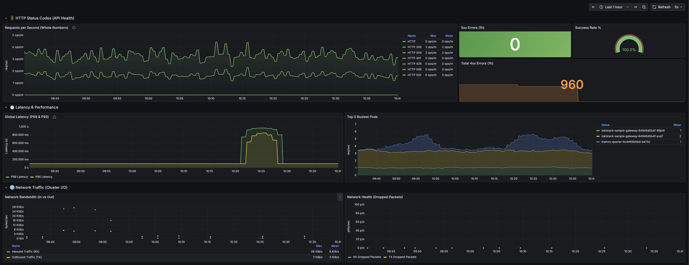
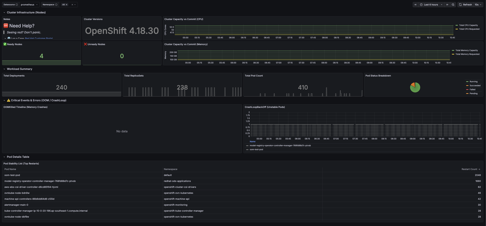
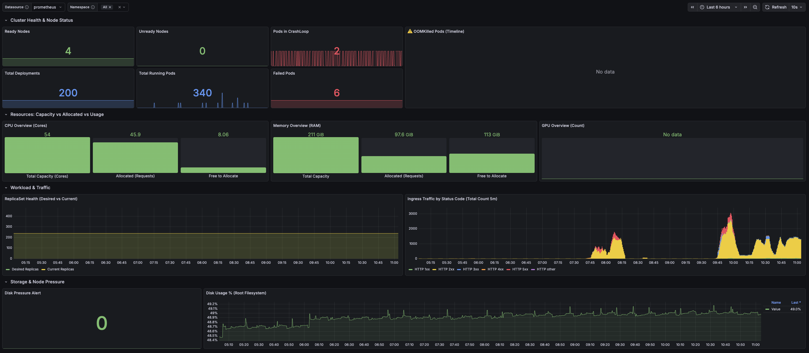
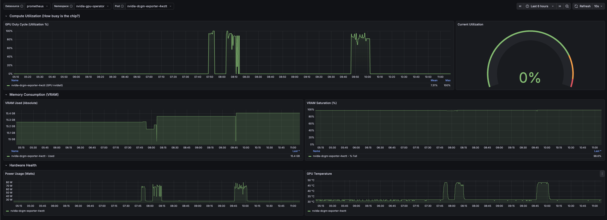
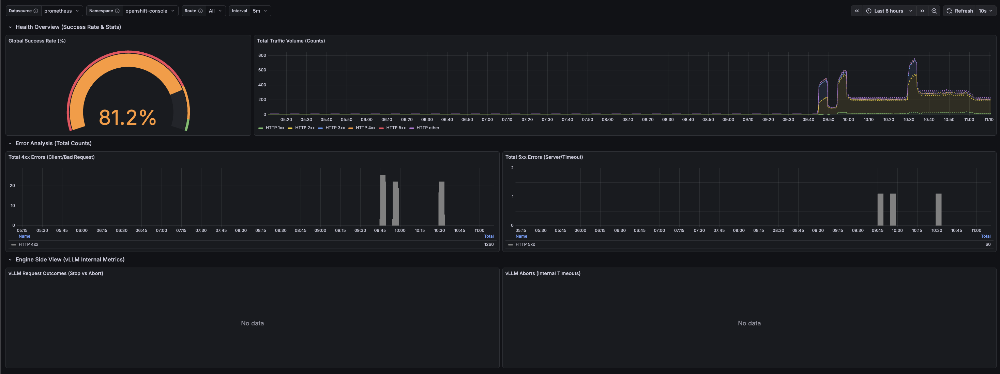
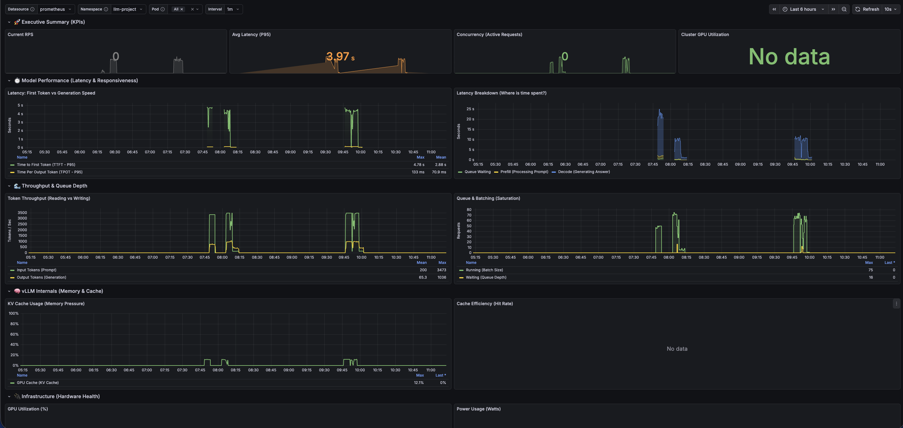
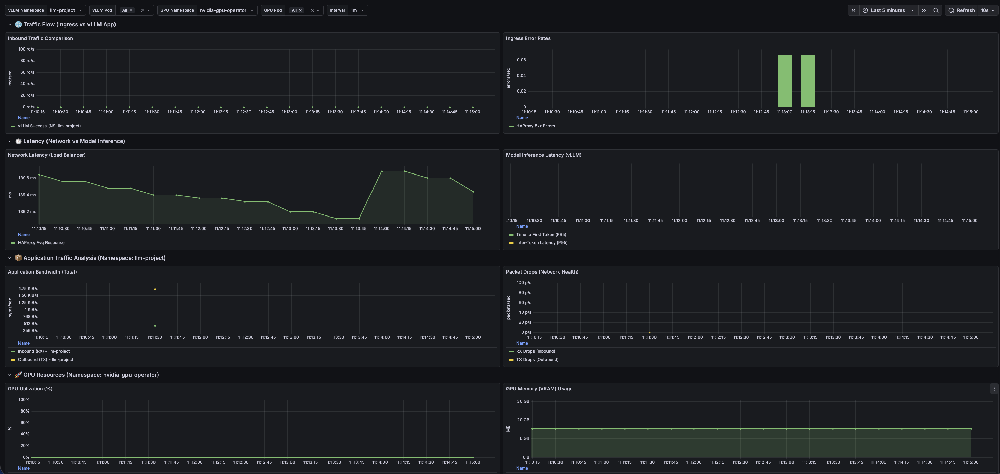

# 📊 RHOAI & Cluster Monitoring Dashboards

This repository contains a suite of 10 production-ready Grafana dashboards designed for Red Hat OpenShift AI (RHOAI) and Kubernetes environments. These dashboards provide end-to-end visibility, ranging from physical cluster infrastructure to high-level API traffic and specific AI model performance (vLLM/GPU).

## 📑 Table of Contents

1.  [Admin: API & Network Analysis](#1--admin-api--network-analysis)
2.  [Admin: Cluster Health](#2--admin-cluster-health)
3.  [Admin: OCP Cluster Overview](#3--admin-ocp-cluster-overview)
4.  [Admin: VPA Optimization & Health](#4--admin-vpa-optimization--health)
5.  [ACM: Right-Sizing Namespace](#5--acm-right-sizing-namespace)
6.  [RHOAI: GPU Utilization & Consumption](#6--rhoai-gpu-utilization--consumption)
7.  [RHOAI: Inference Endpoint Monitoring](#7--rhoai-inference-endpoint-monitoring)
8.  [RHOAI: vLLM & GPU Master Dashboard](#8--rhoai-vllm--gpu-master-dashboard)
9.  [RHOAI: vLLM Performance Monitor](#9--rhoai-vllm-performance-monitor)
10. [vLLM: Advanced Performance Dashboard](#10--vllm-advanced-performance-dashboard)

---

## 1. 🚦 Admin: API & Network Analysis

This Grafana dashboard provides a high-level overview of API health, HTTP status codes, and cluster network traffic. It is designed to help SREs and Administrators quickly identify API degradation, high error rates, or network saturation issues within the cluster.

### 📸 Screenshots

### 📊 Metrics & Panels Breakdown

#### 🚦 HTTP Status Codes (API Health)
This section focuses on the reliability of your HTTP services (Ingress/API).

| Panel Name | Metric / Query | Description |
| :--- | :--- | :--- |
| **Requests per Second** | `sum by (code) (rate(http_requests_total[1m]))` or `sum by (status) (rate(nginx_ingress_controller_requests[1m]))` | Total rate of requests grouped by HTTP Status Code. Decimals are hidden for readability. Green lines indicate success; red/orange indicate errors. |
| **5xx Errors (1h)** | `sum(increase(http_requests_total{code=~"5.."}[1h]))` | The total count of server-side errors over the last hour. A rising number indicates the application is crashing or failing. |
| **Success Rate %** | `sum(rate(http_requests_total{code!~"5.."}[5m])) / sum(rate(http_requests_total[5m])) * 100` | A gauge showing the percentage of non-5xx requests. • **Green:** > 99%  • **Orange:** < 99%  • **Red:** < 95% |
| **Total 4xx Errors (1h)** | `sum(increase(http_requests_total{code=~"4.."}[1h]))` | The total count of client-side errors over the last hour. High numbers usually indicate bad client configurations or aggressive scanning. |

#### ⏱️ Latency & Performance
This section tracks how fast the application is responding to users.

| Panel Name | Metric / Query | Description |
| :--- | :--- | :--- |
| **Global Latency (P99 & P95)** | `histogram_quantile(0.99/0.95, sum(rate(http_request_duration_seconds_bucket[5m])) by (le))` | Calculates histogram quantiles for response time. • **P99:** The slowest 1% of requests (worst-case scenario). • **P95:** The standard benchmark for "slow" requests. |
| **Top 5 Busiest Pods** | `topk(5, sum by (pod) (rate(http_requests_total[5m])))` | Identifies the top 5 pods handling the most traffic. Useful for spotting "hotspots" or load-balancing issues. |

#### 🌐 Network Traffic (Cluster I/O)
This section monitors raw networking throughput and health, targeting `vllm` or `llm` namespaces.

| Panel Name | Metric / Query | Description |
| :--- | :--- | :--- |
| **Network Bandwidth (In vs Out)** | `container_network_receive_bytes_total` `container_network_transmit_bytes_total` | Measures data throughput in Bytes/sec for vLLM/LLM namespaces. Essential for detecting network saturation or large data transfers. |
| **Network Health (Dropped Packets)** | `container_network_receive_packets_dropped_total` `container_network_transmit_packets_dropped_total` | Counts the rate of dropped packets. Any value above 0 indicates network congestion, CNI issues, or hardware limits being reached. |

### 🛠️ Prerequisites

1.  **Prometheus Datasource:** The dashboard expects a datasource named `prometheus` (or the default datasource).
2.  **Metrics Exporters:**
    * **Application Metrics:** Apps must export standard Prometheus HTTP metrics (`http_requests_total`, `http_request_duration_seconds_bucket`).
    * **cAdvisor / Kubelet:** Required for `container_network_*` metrics.
    * **Ingress Controller:** (Optional) If using NGINX Ingress, it will pick up `nginx_ingress_controller_requests`.

### 🏷️ Tags
`network`, `http`, `status-codes`, `detailed`

---

## 2. 🏥 Admin: Cluster Health

This Grafana dashboard serves as a comprehensive "Single Pane of Glass" for monitoring the overall health, capacity, and stability of your Kubernetes/OpenShift cluster. It spans infrastructure-level metrics (Nodes, GPU, Network) through to workload health (Pods, Deployments), with dedicated sections for OOMKills, CrashLoops, and per-node resource breakdowns.

### 📸 Screenshots

### 📊 Metrics & Panels Breakdown

#### 🏥 Cluster Health Overview
High-level cluster health indicators and resource utilization at a glance.

| Panel Name | Metric / Query | Description |
| :--- | :--- | :--- |
| **🔖 Cluster Version** | `max by (version) (cluster_version{type="current"})` | Displays the current OpenShift/Kubernetes version. Essential for tracking upgrades and compliance. |
| **✅ Ready Nodes** | `sum(kube_node_status_condition{condition="Ready", status="true"})` | Count of healthy nodes currently available to schedule workloads. |
| **❌ Unready Nodes** | `sum(kube_node_status_condition{condition="Ready", status!="true"})` | Count of broken or disconnected nodes. Any value > 0 requires immediate attention. |
| **🖥️ Total Nodes** | `count(kube_node_info)` | The total number of nodes registered in the cluster. |
| **🚨 Firing Alerts** | `sum(ALERTS{alertstate="firing", severity=~"warning\|critical"})` | Count of currently active warning and critical Prometheus alerts across the cluster. |
| **🧠 Cluster CPU Utilization %** | `100 * (1 - sum(rate(node_cpu_seconds_total{mode="idle"}[5m])) / sum(rate(node_cpu_seconds_total[5m])))` | Real-time CPU utilization percentage across all cluster nodes. |
| **💾 Cluster Memory Utilization %** | `100 * (1 - sum(node_memory_MemAvailable_bytes) / sum(node_memory_MemTotal_bytes))` | Real-time memory utilization percentage across all cluster nodes. |
| **⚡ Cluster CPU — Capacity vs Usage vs Requested** | `kube_node_status_allocatable{resource="cpu"}` `container_cpu_usage_seconds_total` | Compares total allocatable CPU cores against actual usage and pod requests. Helps identify over-provisioning or capacity bottlenecks. |
| **💾 Cluster Memory — Capacity vs Usage vs Requested** | `node_memory_MemTotal_bytes` `node_memory_MemAvailable_bytes` | Compares total cluster RAM against actual usage. Critical for preventing node-level OOMs. |

#### 🖥️ Node-Level Breakdown
Per-node resource utilization for targeted investigation.

| Panel Name | Metric / Query | Description |
| :--- | :--- | :--- |
| **🧠 Per-Node CPU Utilization %** | `100 * (1 - avg by (instance) (rate(node_cpu_seconds_total{mode="idle"}[5m])))` | CPU utilization broken down per node. Useful for spotting hot nodes under disproportionate load. |
| **💾 Per-Node Memory Utilization %** | `100 * (1 - node_memory_MemAvailable_bytes / node_memory_MemTotal_bytes)` | Memory utilization broken down per node. Helps identify nodes approaching capacity before pod eviction. |
| **📈 Per-Node CPU % Over Time** | `100 * (1 - avg by (instance) (rate(node_cpu_seconds_total{mode="idle"}[5m])))` | Time-series graph of CPU utilization per node. Useful for identifying sustained spikes or gradual resource creep. |

#### 🔥 GPU Monitoring (NVIDIA DCGM)
Cluster-wide and per-device GPU health metrics powered by the NVIDIA DCGM Exporter.

| Panel Name | Metric / Query | Description |
| :--- | :--- | :--- |
| **🎮 Avg GPU Utilization %** | `avg(DCGM_FI_DEV_GPU_UTIL)` | Average GPU compute utilization across all devices in the cluster. |
| **🗄️ Avg GPU VRAM Usage %** | `100 * avg(DCGM_FI_DEV_FB_USED / (DCGM_FI_DEV_FB_USED + DCGM_FI_DEV_FB_FREE))` | Average VRAM saturation across all GPUs. Approaching 100% risks OOM errors and inference crashes. |
| **🌡️ Avg GPU Temperature** | `avg(DCGM_FI_DEV_GPU_TEMP)` | Average GPU core temperature in Celsius. Sustained temperatures above 85°C risk thermal throttling. |
| **⚡ Total GPU Power Draw** | `sum(DCGM_FI_DEV_POWER_USAGE)` | Total power consumption across all GPUs. Useful for capacity planning and energy cost tracking. |
| **📈 GPU Utilization % Per Device** | `DCGM_FI_DEV_GPU_UTIL` | Per-GPU compute utilization time series. Highlights imbalanced load distribution across cards. |
| **🗄️ GPU VRAM Used vs Free Per Device** | `DCGM_FI_DEV_FB_USED` `DCGM_FI_DEV_FB_FREE` | Per-GPU breakdown of used vs. available VRAM. Helps identify which specific cards are memory-constrained. |
| **🌡️ GPU Temperature Per Device** | `DCGM_FI_DEV_GPU_TEMP` | Per-GPU temperature readings. Allows targeted identification of overheating cards. |
| **⚡ GPU Power Draw Per Device** | `DCGM_FI_DEV_POWER_USAGE` | Per-GPU instantaneous power draw. Useful for detecting unusually power-hungry workloads on specific cards. |

#### 🌐 Network I/O
Node-level network throughput and packet health.

| Panel Name | Metric / Query | Description |
| :--- | :--- | :--- |
| **⬇️ Network Receive (per Node)** | `sum by (instance) (rate(node_network_receive_bytes_total{device!~"lo\|veth.*\|docker.*\|..."}[5m]))` | Inbound network bandwidth per node, filtered to physical interfaces. Essential for detecting network saturation. |
| **⬆️ Network Transmit (per Node)** | `sum by (instance) (rate(node_network_transmit_bytes_total{...}[5m]))` | Outbound network bandwidth per node. Compare across nodes to spot unbalanced egress patterns. |
| **⚠️ Network Packet Drops (per Node)** | `node_network_receive_drop_total` `node_network_transmit_drop_total` | Rate of dropped packets per node in both directions. Non-zero values indicate network congestion or CNI/SDN issues. |

#### 📦 Workload Summary
Summarizes the state of applications running in the selected namespace(s).

| Panel Name | Metric / Query | Description |
| :--- | :--- | :--- |
| **🚀 Total Deployments** | `count(kube_deployment_metadata_generation{namespace=~"$namespace"})` | Total number of Deployment objects in the selected namespace(s). |
| **📋 Total ReplicaSets** | `count(kube_replicaset_status_fully_labeled_replicas{namespace=~"$namespace"})` | Number of fully labeled ReplicaSets — a proxy for healthy, active replica controllers. |
| **🫛 Total Pod Count** | `sum(kube_pod_info{namespace=~"$namespace"})` | Absolute count of all pods in the selected namespace(s). |
| **🍩 Pod Status Breakdown** | `sum by (phase) (kube_pod_status_phase{namespace=~"$namespace"})` | Pie chart of pods by phase (Running, Pending, Failed, Succeeded). |

#### ⚠️ Critical Events & Errors (OOM / CrashLoop)
Stability indicators designed to catch application crashes and resource starvation.

| Panel Name | Metric / Query | Description |
| :--- | :--- | :--- |
| **💥 OOMKilled Timeline** | `kube_pod_container_status_last_terminated_reason{reason="OOMKilled"}` | Tracks pods killed by the kernel due to exceeding memory limits. Spikes indicate undersized memory requests. |
| **🔄 CrashLoopBackOff (Unstable Pods)** | `kube_pod_container_status_waiting_reason{reason="CrashLoopBackOff"}` | Tracks pods failing to start repeatedly (e.g., config errors, missing dependencies). |

#### 📋 Pod Details Table
A detailed drill-down view for identifying specific problem pods.

| Panel Name | Metric / Query | Description |
| :--- | :--- | :--- |
| **🔁 Pod Stability List (Top Restarts)** | `sum by (namespace, pod) (kube_pod_container_status_restarts_total{namespace=~"$namespace"})` | Lists pods sorted by restart count. High restart counts indicate unstable applications or failing liveness probes. |

### 🛠️ Prerequisites

1.  **Prometheus Datasource:** The dashboard expects a datasource named `prometheus` (or selects one via the `$DS_PROMETHEUS` variable).
2.  **kube-state-metrics:** Required for all `kube_*` metrics. Most OpenShift and K8s distributions include this by default.
3.  **node-exporter:** Required for per-node CPU, memory, and network metrics (`node_cpu_seconds_total`, `node_memory_*`, `node_network_*`).
4.  **NVIDIA GPU Operator / DCGM Exporter:** Required for all `DCGM_FI_DEV_*` GPU metrics.

### 🏷️ Tags
`kubernetes`, `openshift`, `gpu`, `nvidia`, `cluster`

---

## 3. 🏥 Admin: OCP Cluster Overview

This Grafana dashboard provides a comprehensive "Infrastructure-First" view of your OpenShift Container Platform (OCP) cluster. It bridges physical node health (CPU/Memory/Disk) with application workload stability (ReplicaSets, CrashLoops, Ingress), making it ideal for Cluster Admins and SREs who need to answer "Is the cluster healthy?" at a glance.

### 📸 Screenshots

### 📊 Metrics & Panels Breakdown

#### 🏗️ Cluster Health & Node Status
Immediate "Red/Green" status indicators for the cluster's physical infrastructure and critical pod states.

| Panel Name | Metric / Query | Description |
| :--- | :--- | :--- |
| **Ready Nodes** | `sum(kube_node_status_condition{condition="Ready", status="true"})` | Count of healthy nodes currently online and accepting workloads. |
| **Unready Nodes** | `sum(kube_node_status_condition{condition="Ready", status!="true"})` | Count of offline or partitioned nodes. A non-zero value is a critical alert. |
| **Pods in CrashLoop** | `count(kube_pod_container_status_waiting_reason{reason="CrashLoopBackOff"})` | Number of pods currently stuck in a restart loop. Useful for spotting broken deployments immediately. |
| **⚠️ OOMKilled Pods (Timeline)** | `kube_pod_container_status_last_terminated_reason{reason="OOMKilled"}` | Time-series graph showing when pods were killed due to Out-Of-Memory errors. Peaks indicate memory sizing issues. |
| **Total Deployments** | `count(kube_deployment_status_observed_generation{namespace=~"$namespace"})` | Total number of Deployment objects in the selected namespace(s). |
| **Total Running Pods** | `sum(kube_pod_status_phase{phase="Running", namespace=~"$namespace"})` | Count of pods currently in the "Running" phase. |
| **Failed Pods** | `sum(kube_pod_status_phase{phase=~"Failed\|Unknown", namespace=~"$namespace"})` | Count of pods that have terminated with an error or are in an unknown state. |

#### 🔋 Resources: Capacity vs Allocated vs Usage
Visualizes the cluster's "Resource Budget" — helping identify capacity shortfalls and over-provisioning.

| Panel Name | Metric / Query | Description |
| :--- | :--- | :--- |
| **CPU Overview (Cores)** | `kube_node_status_allocatable{resource="cpu"}` `kube_pod_container_resource_requests{resource="cpu"}` | Total allocatable CPU cores vs. CPU requested by pods. Shows remaining "Free to Allocate" capacity. |
| **Memory Overview (RAM)** | `kube_node_status_allocatable{resource="memory"}` `kube_pod_container_resource_requests{resource="memory"}` | Total allocatable RAM vs. memory requested by pods. |
| **GPU Overview (Count)** | `kube_node_status_allocatable{resource="nvidia.com/gpu"}` `kube_pod_container_resource_requests{resource="nvidia.com/gpu"}` | Physical GPU inventory vs. GPU resources claimed by pods. |

#### 🚦 Workload & Traffic
Monitors application scalability and external traffic flow.

| Panel Name | Metric / Query | Description |
| :--- | :--- | :--- |
| **ReplicaSet Health (Desired vs Current)** | `kube_replicaset_spec_replicas` `kube_replicaset_status_replicas` | Compares "Desired" vs "Current" replicas. A gap indicates the cluster cannot schedule new pods, likely due to resource exhaustion. |
| **Ingress Traffic by Status Code** | `sum by (code) (increase(haproxy_backend_http_responses_total{...}[5m]))` | Tracks HTTP response codes (2xx, 4xx, 5xx) through the OpenShift HAProxy Ingress. |

#### 💾 Storage & Node Pressure
Disk health monitoring to prevent node failures from full filesystems.

| Panel Name | Metric / Query | Description |
| :--- | :--- | :--- |
| **Disk Pressure Alert** | `sum(kube_node_status_condition{condition="DiskPressure", status="true"})` | Counts nodes reporting "DiskPressure." Values > 0 mean pods are being evicted to free space. |
| **Disk Usage % (Root Filesystem)** | `(node_filesystem_size_bytes - node_filesystem_free_bytes) / node_filesystem_size_bytes` | Percentage of disk space used on the root (`/`) filesystem per node. High usage (>85%) warrants immediate cleanup. |

### 🛠️ Prerequisites

1.  **Prometheus Datasource:** The dashboard expects a datasource named `prometheus` (or selects one via the `$DS_PROMETHEUS` variable).
2.  **kube-state-metrics:** Required for all `kube_*` metrics (Node status, Pod phases, Resource requests).
3.  **node-exporter:** Required for disk usage metrics (`node_filesystem_*`).
4.  **HAProxy / Ingress Controller:** Required for `haproxy_*` metrics (exported by the OpenShift default router).

### 🏷️ Tags
`kubernetes`, `ocp`, `infrastructure`

---

## 4. ⚖️ Admin: VPA Optimization & Health

This dashboard provides a comprehensive look at your Kubernetes Vertical Pod Autoscalers (VPA). It lets you track VPA adoption, visualize how resource recommendations evolve over time, and compare VPA targets directly against your actual pod limits and requests — enabling data-driven right-sizing decisions.

### 📸 Screenshots

### 📊 Metrics & Panels Breakdown

#### 🚀 VPA Executive Summary
A quick snapshot of your autoscaling landscape.

| Panel Name | Metric / Query | Description |
| :--- | :--- | :--- |
| **Total VPAs Monitored** | `count(max by (verticalpodautoscaler, namespace) (kube_customresource_verticalpodautoscaler_status_recommendation_...))` | Total number of active VPA objects currently generating recommendations in the selected namespace(s). |
| **VPA Update Mode Distribution** | `sum by (updateMode) (kube_customresource_verticalpodautoscaler_spec_updatepolicy_updatemode)` | Pie chart breaking down VPAs by update mode (`Auto`, `Off`, `Initial`, `Recreate`). |

#### 📈 Resource Recommendations Trends
Visualizes how the VPA engine adapts to workload changes over time.

| Panel Name | Metric / Query | Description |
| :--- | :--- | :--- |
| **CPU Recommendations (Target) Over Time** | `max by (verticalpodautoscaler, container) (kube_customresource_verticalpodautoscaler_status_recommendation_containerrecommendations_target_cpu)` | Time-series tracking the VPA's ideal CPU target per container. Shows how recommendations adapt to workload patterns. |
| **Memory Recommendations (Target) Over Time** | `max by (verticalpodautoscaler, container) (kube_customresource_verticalpodautoscaler_status_recommendation_containerrecommendations_target_memory)` | Time-series tracking the VPA's ideal memory target per container. |

#### 📋 Detailed Container Analysis
The master data table for pinpointing exact optimization opportunities.

| Panel Name | Metric / Query | Description |
| :--- | :--- | :--- |
| **VPA Recommendations vs Actual Provisioning** | Multi-query join: `Lowerbound`, `Target`, `Upperbound` vs. actual `Requests` and `Limits` | A heavily transformed table merging VPA recommendation bounds with actual pod provisioning. Allows SREs to immediately spot over-provisioned (waste) or under-provisioned (risk) containers. |

### 🛠️ Prerequisites

1.  **Prometheus Datasource:** The dashboard expects a datasource named `prometheus` (or selects one via the `$DS_PROMETHEUS` variable).
2.  **kube-state-metrics:** Must export Kubernetes Custom Resources (specifically VPA types via `kube_customresource_verticalpodautoscaler_*`).
3.  **VPA Deployed:** The Vertical Pod Autoscaler must be deployed and actively generating recommendation objects on your cluster.

### 🏷️ Tags
`vpa`, `autoscaling`, `kubernetes`

---

## 5. 📐 ACM: Right-Sizing Namespace

This dashboard leverages **Red Hat Advanced Cluster Management (ACM)** right-sizing metrics to help Platform Engineers and FinOps teams identify over-provisioned namespaces across their fleet. It compares actual CPU and memory usage against current requests and ACM-generated recommendations, enabling data-driven resource optimization at the namespace level.

### 📸 Screenshots

### 📊 Metrics & Panels Breakdown

#### 🖥️ CPU Right-Sizing
Surfaces CPU inefficiencies by comparing usage, requests, and ACM recommendations.

| Panel Name | Metric / Query | Description |
| :--- | :--- | :--- |
| **CPU Recommendation** | `max_over_time(sum by (cluster)(acm_rs:cluster:cpu_recommendation{cluster="$cluster", profile="$profile"})[$days:])` | The ACM-computed optimal CPU allocation for the cluster over the selected window. Use as the target for resource quota adjustments. |
| **CPU Usage** | `max_over_time(sum by (cluster)(acm_rs:cluster:cpu_usage{...})[$days:])` | Actual CPU consumed by workloads. Compare against requests to identify over-provisioning. |
| **CPU Request** | `max_over_time(sum by (cluster)(acm_rs:cluster:cpu_request{...})[$days:])` | Total CPU cores currently requested by all pods. A large gap between request and usage indicates wasted reserved capacity. |
| **CPU Utilization** | `acm_rs:cluster:cpu_usage / acm_rs:cluster:cpu_request` | Derived utilization percentage showing how efficiently reserved CPU cores are being used. |
| **CPU Utilization of Top Namespaces** | `topk(20, sum by (namespace) (acm_rs:namespace:cpu_usage) / sum by (namespace) (acm_rs:namespace:cpu_request))` | Ranked view of the top 20 namespaces by CPU utilization ratio. Quickly identifies least-efficient consumers to prioritize for right-sizing. |
| **CPU Quota** | `acm_rs:namespace:cpu_usage / acm_rs:namespace:cpu_request` (+ absolute usage) | Per-namespace CPU usage vs. assigned quota. Helps enforce fair resource distribution across teams. |

#### 🧠 Memory Right-Sizing
Mirrors the CPU analysis for RAM, highlighting memory over-allocation and optimization opportunities.

| Panel Name | Metric / Query | Description |
| :--- | :--- | :--- |
| **Memory Recommendation** | `max_over_time(sum by (cluster)(acm_rs:cluster:memory_recommendation{...})[$days:])` | The ACM-computed optimal memory allocation for the cluster. Use as a baseline for adjusting namespace-level resource quotas. |
| **Memory Usage** | `max_over_time(sum by (cluster)(acm_rs:cluster:memory_usage{...})[$days:])` | Actual RAM consumed by workloads. Compare against requests to find namespaces with inflated memory reservations. |
| **Memory Request** | `max_over_time(sum by (cluster)(acm_rs:cluster:memory_request{...})[$days:])` | Total memory currently requested by all pods. High requests relative to usage signal idle or over-provisioned workloads. |
| **Memory Utilization** | `acm_rs:cluster:memory_usage / acm_rs:cluster:memory_request` | Derived memory utilization percentage — a quick "efficiency score" for the cluster's RAM allocation. |
| **Memory Utilization of Top Namespaces** | `topk(20, sum by (namespace) (acm_rs:namespace:memory_usage) / sum by (namespace) (acm_rs:namespace:memory_request))` | Ranked view of the top 20 namespaces by memory utilization ratio. Useful for targeting optimization efforts. |
| **Memory Quota** | `acm_rs:namespace:memory_usage / acm_rs:namespace:memory_request` (+ absolute usage) | Per-namespace memory usage vs. assigned quota, ensuring teams stay within their allocated boundaries. |

### 🛠️ Prerequisites

1.  **Prometheus Datasource:** The dashboard expects a datasource named `prometheus` (or selects one via the `$DS_PROMETHEUS` variable).
2.  **Red Hat ACM:** Advanced Cluster Management must be installed with the **right-sizing** feature enabled to populate `acm_rs:*` metrics.
3.  **ACM Observability:** The ACM Observability stack (Thanos/Prometheus) must be configured to collect and federate `acm_rs:*` recording rules from managed clusters.

### 🏷️ Tags
`ACM`, `Right-Sizing`

---

## 6. 🧠 RHOAI: GPU Utilization & Consumption

This dashboard provides a deep dive into the performance and health of NVIDIA GPUs within a Red Hat OpenShift AI (RHOAI) environment. It uses metrics from the **NVIDIA DCGM Exporter** to visualize how effectively your AI/ML models are utilizing the underlying hardware — tracking compute load, VRAM consumption, and physical health stats like power and temperature, scoped to specific pods and namespaces.

### 📸 Screenshots

### 📊 Metrics & Panels Breakdown

#### ⚡ Compute Utilization (How busy is the chip?)
Determines if models are actively using GPU compute cycles or sitting idle.

| Panel Name | Metric / Query | Description |
| :--- | :--- | :--- |
| **GPU Duty Cycle (Utilization %)** | `avg by (pod, device) (DCGM_FI_DEV_GPU_UTIL{namespace="$namespace", pod=~"$pod"})` | Time-series showing the percentage of time GPU kernels were active per pod and device. High usage (80–90%) indicates an efficient workload; low usage implies bottlenecks elsewhere (e.g., data loading). |
| **Current Utilization** | `avg(DCGM_FI_DEV_GPU_UTIL{namespace="$namespace", pod=~"$pod"})` | Gauge showing the real-time average utilization across selected pods. |

#### 💾 Memory Consumption (VRAM)
Monitoring VRAM is critical — OOM errors cause immediate inference crashes.

| Panel Name | Metric / Query | Description |
| :--- | :--- | :--- |
| **VRAM Used (Absolute)** | `max by (pod, device) (DCGM_FI_DEV_FB_USED{namespace="$namespace", pod=~"$pod"}) * 1024 * 1024` | Actual Frame Buffer (VRAM) memory allocated by the model, converted from MiB to bytes. |
| **VRAM Saturation (%)** | `DCGM_FI_DEV_FB_USED / (DCGM_FI_DEV_FB_USED + DCGM_FI_DEV_FB_FREE) * 100` | VRAM usage as a percentage of total card capacity. Consistently hitting 100% means you need a larger GPU or a smaller batch size. |

#### 🌡️ Hardware Health
Monitors the physical state of GPU cards to detect throttling or hardware failure.

| Panel Name | Metric / Query | Description |
| :--- | :--- | :--- |
| **Power Usage (Watts)** | `DCGM_FI_DEV_POWER_USAGE{namespace="$namespace", pod=~"$pod"}` | Instantaneous power draw per GPU. Useful for capacity planning and identifying power-hungry workloads. |
| **GPU Temperature** | `DCGM_FI_DEV_GPU_TEMP{namespace="$namespace", pod=~"$pod"}` | Core temperature in Celsius. Sustained temperatures above 85°C may lead to thermal throttling, slowing AI model inference. |

### 🛠️ Prerequisites

1.  **Prometheus Datasource:** The dashboard expects a datasource named `prometheus` (or selects one via the `$DS_PROMETHEUS` variable).
2.  **NVIDIA GPU Operator:** This dashboard relies on the `nvidia-dcgm-exporter`, automatically deployed by the NVIDIA GPU Operator in OpenShift/RHOAI.
3.  **DCGM Metrics:** The `DCGM_FI_DEV_*` metrics must be enabled in your DCGM exporter config (this is the default).

### 🏷️ Tags
`rhoai`, `gpu`, `nvidia`, `ai`, `ml`, `monitoring`

---

## 7. 🧠 RHOAI: Inference Endpoint Monitoring

This dashboard provides a dedicated view for monitoring the health and traffic patterns of AI Inference Endpoints (vLLM, TGIS, Caikit) deployed on Red Hat OpenShift AI. It correlates external traffic via HAProxy Ingress with internal vLLM engine metrics to pinpoint whether errors are network-related or model-related.

### 📸 Screenshots

### 📊 Metrics & Panels Breakdown

#### 🏥 Health Overview (Success Rate & Stats)
Immediate "Green/Red" signal on the availability of your model serving endpoints.

| Panel Name | Metric / Query | Description |
| :--- | :--- | :--- |
| **Global Success Rate (%)** | `sum(rate(haproxy_backend_http_responses_total{code=~"2.."}[$interval])) / sum(rate(haproxy_backend_http_responses_total[$interval])) * 100` | Gauge showing the percentage of `2xx` responses vs. total requests. • **Green:** > 95%  • **Orange:** > 80%  • **Red:** < 80% |
| **Total Traffic Volume (Counts)** | `sum by (code) (increase(haproxy_backend_http_responses_total{...}[$interval]))` | Count of total requests over the selected interval, broken down by HTTP status code. Useful for validating load tests or identifying traffic spikes. |

#### 🚨 Error Analysis (Total Counts)
Isolates bad traffic to help debug client vs. server issues.

| Panel Name | Metric / Query | Description |
| :--- | :--- | :--- |
| **Total 4xx Errors (Client/Bad Request)** | `sum by (code) (increase(haproxy_backend_http_responses_total{code=~"4.."}[$interval]))` | Counts client-side errors (e.g., 400 Bad Request, 401 Unauthorized). High numbers often indicate invalid JSON payloads or incorrect authentication. |
| **Total 5xx Errors (Server/Timeout)** | `sum by (code) (increase(haproxy_backend_http_responses_total{code=~"5.."}[$interval]))` | Counts server-side errors (e.g., 500 Internal Error, 504 Gateway Timeout). High numbers indicate the model container has crashed or timed out. |

#### ⚙️ Engine Side View (vLLM Internal Metrics)
Looks *inside* the model server (vLLM) to understand how requests were processed.

| Panel Name | Metric / Query | Description |
| :--- | :--- | :--- |
| **vLLM Request Outcomes (Stop vs Abort)** | `sum by (finished_reason) (rate(vllm:request_success_total{namespace="$namespace"}[$interval]))` | Breaks down completed requests by outcome: • **stop:** Successfully generated EOS token. • **length:** Hit max token limit (truncated). • **abort:** Client disconnected early. |
| **vLLM Aborts (Internal Timeouts)** | `sum(rate(vllm:request_success_total{finished_reason="abort"}[$interval]))` | Tracks aborted requests specifically. A spike here means the client or upstream proxy timed out before the model finished generating. |

### 🛠️ Prerequisites

1.  **Prometheus Datasource:** The dashboard expects a datasource named `prometheus` (or selects one via the `$DS_PROMETHEUS` variable).
2.  **HAProxy / OpenShift Router:** Required for ingress metrics (`haproxy_backend_http_responses_total`).
3.  **vLLM / RHOAI Runtime:** Your model serving runtime must expose standard vLLM Prometheus metrics (`vllm:request_success_total`).

### 🏷️ Tags
`rhoai`, `vllm`, `inference`, `nvidia`, `redhat`

---

## 8. 🚀 RHOAI: vLLM & GPU Master Dashboard

This is the ultimate "Single Pane of Glass" for AI Engineers and SREs running Large Language Models (LLMs) on Red Hat OpenShift AI. It directly correlates **Application Metrics** (vLLM inference speed, queue depth, cache usage) with **Infrastructure Metrics** (GPU utilization, power, memory) in one unified view.

### 📸 Screenshots

### 📊 Metrics & Panels Breakdown

#### 🚀 Executive Summary (KPIs)
Top-level health indicators for quick triage.

| Panel Name | Metric / Query | Description |
| :--- | :--- | :--- |
| **Current RPS** | `sum(rate(vllm:request_success_total{namespace="$namespace", pod=~"$pod"}[$interval]))` | Real-time Requests Per Second successfully processed by the model server. |
| **Avg Latency (P95)** | `histogram_quantile(0.95, sum(rate(vllm:e2e_request_latency_seconds_bucket{...}[$interval])) by (le))` | End-to-end latency for 95% of requests, including queue time and processing time. |
| **Concurrency (Active Requests)** | `sum(vllm:num_requests_running{namespace="$namespace", pod=~"$pod"})` | Number of requests currently being processed in parallel (effective batch size). |
| **Cluster GPU Utilization** | `avg(DCGM_FI_DEV_GPU_UTIL{namespace="$namespace", pod=~"$pod"})` | Average GPU compute utilization across all selected pods. |

#### ⏱️ Model Performance (Latency & Responsiveness)
Deep dive into user-experience latency metrics.

| Panel Name | Metric / Query | Description |
| :--- | :--- | :--- |
| **Latency: First Token vs Generation Speed** | `histogram_quantile(0.95, rate(vllm:time_to_first_token_seconds_bucket[$interval]))` (TTFT P95) `histogram_quantile(0.95, rate(vllm:time_per_output_token_seconds_bucket[$interval]))` (TPOT P95) | Combined view of Time to First Token and Time Per Output Token at P95. High TTFT indicates slow prefill or heavy queueing; high TPOT indicates GPU saturation. |
| **Latency Breakdown (Where is time spent?)** | `vllm:request_queue_time_seconds_sum` `vllm:request_prefill_time_seconds_sum` | Stacked graph pinpointing where latency originates — queueing, prompt prefill, or token decode — enabling precise bottleneck identification. |

#### 🌊 Throughput & Queue Depth
Analyzes traffic volume and system saturation.

| Panel Name | Metric / Query | Description |
| :--- | :--- | :--- |
| **Token Throughput (Reading vs Writing)** | `rate(vllm:prompt_tokens_total[$interval])` vs `rate(vllm:generation_tokens_total[$interval])` | Compares input token processing speed (prefill) against output token generation speed (decode). |
| **Queue & Batching (Saturation)** | `vllm:num_requests_running` vs `vllm:num_requests_waiting` | Visualizes system saturation. If "Waiting" > 0, the system is full and requests are queuing — a clear capacity signal. |

#### 🧠 vLLM Internals (Memory & Cache)
Critical for performance tuning and preventing out-of-memory failures.

| Panel Name | Metric / Query | Description |
| :--- | :--- | :--- |
| **KV Cache Usage (Memory Pressure)** | `vllm:gpu_cache_usage_perc` `vllm:cpu_cache_usage_perc` | Percentage of GPU *and* CPU memory reserved for the KV Cache. If GPU cache hits 100%, vLLM will start swapping to CPU or rejecting requests. |
| **Cache Efficiency (Hit Rate)** | `sum(rate(vllm:request_prefix_cache_hits[$interval])) / sum(rate(vllm:request_prefix_cache_queries[$interval]))` | The hit rate of the prefix cache. Higher rates mean better performance for workloads with repeated system prompts, reducing redundant computation. |

#### 🔌 Infrastructure (Hardware Health)
Physical GPU stats from the NVIDIA GPU Operator.

| Panel Name | Metric / Query | Description |
| :--- | :--- | :--- |
| **GPU Utilization (%)** | `avg by (pod, device) (DCGM_FI_DEV_GPU_UTIL{namespace="$namespace", pod=~"$pod"})` | Per-GPU core utilization. |
| **Power Usage (Watts)** | `DCGM_FI_DEV_POWER_USAGE{namespace="$namespace", pod=~"$pod"}` | Real-time power consumption per card. |

### 🛠️ Prerequisites

1.  **Prometheus Datasource:** The dashboard expects a datasource named `prometheus` (or selects one via the `$DS_PROMETHEUS` variable).
2.  **vLLM Runtime:** Must be configured to export Prometheus metrics (typically on port `8000` at `/metrics`).
3.  **NVIDIA GPU Operator:** Required for `DCGM_*` hardware metrics.

### 🏷️ Tags
`vllm`, `rhoai`, `gpu`

---

## 9. 📈 RHOAI: vLLM Performance Monitor

This dashboard provides a detailed, full-stack performance view of vLLM model servers on OpenShift, tracing the request lifecycle from Ingress (Network) → Model (Inference) → Hardware (GPU). It features a "Triple-Namespace" selector strategy, allowing metric correlation even when your Router, Application, and GPU Operator live in different namespaces. It also surfaces pod-level CPU and memory visibility for the vLLM application containers.

### 📸 Screenshots

### 📊 Metrics & Panels Breakdown

#### 🌐 Traffic Flow (Ingress vs vLLM App)
Compares external traffic hitting the cluster router against requests actually processed by the application.

| Panel Name | Metric / Query | Description |
| :--- | :--- | :--- |
| **Inbound Traffic Comparison** | `rate(haproxy_backend_sessions_total{namespace=~"$ingress_ns"}[$interval])` vs `rate(vllm:request_success_total{namespace=~"$vllm_ns", pod=~"$vllm_pod"}[$interval])` | Plots "Ingress Sessions" vs "App Successes." A gap between the two lines indicates requests are being dropped before reaching the application. |
| **Ingress Error Rates** | `rate(haproxy_backend_response_errors_total{namespace=~"openshift-ingress"}[$interval])` `rate(haproxy_backend_connection_errors_total{namespace=~"$ingress_ns"}[$interval])` | Tracks both response and connection errors generated by the router itself (e.g., "No backend available"). |

#### ⏱️ Latency (Network vs Model Inference)
Distinguishes between network lag and model processing lag.

| Panel Name | Metric / Query | Description |
| :--- | :--- | :--- |
| **Network Latency (Load Balancer)** | `avg(haproxy_backend_http_average_response_latency_milliseconds{namespace=~"openshift-ingress"})` | Time taken by the load balancer to receive a response. High latency here combined with low model latency implies network congestion. |
| **Model Inference Latency (vLLM)** | `histogram_quantile(0.95, rate(vllm:time_to_first_token_seconds_bucket[$interval]))` (TTFT P95) `histogram_quantile(0.95, rate(vllm:time_per_output_token_seconds_bucket[$interval]))` (TPOT P95) | Actual model latency split into Time to First Token and Time Per Output Token (both P95). High values here mean the model is overloaded or the GPU is saturated. |

#### 📦 Application Traffic Analysis
Monitors raw network I/O at the vLLM pod level.

| Panel Name | Metric / Query | Description |
| :--- | :--- | :--- |
| **Application Bandwidth (Total)** | `rate(container_network_receive_bytes_total{namespace="$vllm_ns"}[$interval])` `rate(container_network_transmit_bytes_total{namespace="$vllm_ns"}[$interval])` | Total inbound and outbound data for vLLM pods. Useful for sizing network policies and detecting saturation. |
| **Packet Drops (Network Health)** | `rate(container_network_receive_packets_dropped_total{namespace="$vllm_ns"}[$interval])` `rate(container_network_transmit_packets_dropped_total{namespace="$vllm_ns"}[$interval])` | Dropped packets at the pod level. Non-zero values indicate CNI/SDN limits are being hit. |

#### 🚀 GPU Resources
Correlates model performance with GPU hardware utilization.

| Panel Name | Metric / Query | Description |
| :--- | :--- | :--- |
| **GPU Utilization (%)** | `avg by (pod) (DCGM_FI_DEV_GPU_UTIL{namespace=~"$gpu_ns", pod=~"$gpu_pod"})` | Per-pod GPU compute utilization. |
| **GPU Memory (VRAM) Usage** | `max by (pod) (DCGM_FI_DEV_FB_USED{namespace=~"$gpu_ns", pod=~"$gpu_pod"}) * 1024 * 1024` | VRAM consumed per pod in bytes. If this flatlines at the maximum, OOM risk is imminent. |

#### 💻 App System Resources
Pod-level CPU and memory consumption for the vLLM application containers.

| Panel Name | Metric / Query | Description |
| :--- | :--- | :--- |
| **vLLM Pod CPU Usage** | `sum(rate(container_cpu_usage_seconds_total{namespace=~"$vllm_ns", pod=~"$vllm_pod", container!="POD"}[$interval])) by (pod)` | CPU core usage per vLLM pod. Useful for right-sizing container resource requests and detecting CPU throttling. |
| **vLLM Pod Memory Usage** | `sum(container_memory_working_set_bytes{namespace=~"$vllm_ns", pod=~"$vllm_pod", container!="POD"}) by (pod)` | Working set memory per vLLM pod. Track this to prevent the pod from being OOMKilled at the container level. |

### 🛠️ Prerequisites

1.  **Prometheus Datasource:** The dashboard expects a datasource named `prometheus` (or selects one via the `$DS_PROMETHEUS` variable).
2.  **vLLM Metrics:** The application must expose standard vLLM Prometheus metrics.
3.  **OpenShift Router Metrics:** Required for `haproxy_*` queries.
4.  **DCGM Exporter:** Required for GPU hardware stats.
5.  **cAdvisor / Kubelet:** Required for `container_cpu_usage_seconds_total` and `container_memory_working_set_bytes`.

### 🏷️ Tags
`performance`, `triple-split-ns`, `traffic-analysis`

---

## 10. ⚡ vLLM: Advanced Performance Dashboard

This dashboard provides the deepest level of vLLM observability, purpose-built for AI Platform Engineers who need to diagnose inference latency, cache efficiency, and request throughput at a granular level. It exposes internal vLLM engine behavior — from per-pod KV cache hit rates to full end-to-end latency distributions — without requiring GPU Operator metrics.

### 📸 Screenshots

### 📊 Metrics & Panels Breakdown

#### ⏱️ Latency Analysis
Measures user-facing inference speed across all critical latency dimensions.

| Panel Name | Metric / Query | Description |
| :--- | :--- | :--- |
| **Time to First Token (TTFT)** | `histogram_quantile(0.50/0.95, rate(vllm:time_to_first_token_seconds_bucket[5m]))` | P50 and P95 latency from request receipt to first generated token. The most critical user-experience metric — high TTFT indicates prefill bottlenecks or heavy queueing. |
| **Inter-Token Latency** | `histogram_quantile(0.50/0.95, rate(vllm:time_per_output_token_seconds_bucket[5m]))` | Time between successive output tokens during the decode phase. High inter-token latency signals GPU saturation or large batch sizes. |
| **End-to-End Request Latency** | `histogram_quantile(0.50/0.95, rate(vllm:e2e_request_latency_seconds_bucket[5m]))` | Complete request lifecycle latency at P50 and P95, covering queuing, prefill, decode, and response. Use for SLA monitoring. |

#### 🧠 KV Cache Efficiency
Exposes prefix cache internals to tune cache-aware routing and optimize system prompts.

| Panel Name | Metric / Query | Description |
| :--- | :--- | :--- |
| **GPU Memory Blocks** | Static gauge (target: 65,592 blocks) | GPU memory blocks allocated for KV cache and model weights. Color thresholds: **Green** (1K–40K), **Yellow** (40K–60K), **Red** (60K+, approaching capacity). |
| **KV Cache Hit Rate** | `sum(vllm:gpu_prefix_cache_hits_total) / sum(vllm:gpu_prefix_cache_queries_total)` | Overall prefix cache efficiency across all pods. **Red** (<30%), **Yellow** (30–60%), **Green** (>60%). Higher rates reduce redundant computation. |
| **Per-Pod Cache Hit Rates** | `vllm:gpu_prefix_cache_hits_total / vllm:gpu_prefix_cache_queries_total` | Bar chart of cache efficiency per individual decode pod. Useful for diagnosing uneven cache-aware routing or identifying idle pods. |

#### 🌊 Throughput & Queue Depth
Analyzes overall system capacity and real-time saturation.

| Panel Name | Metric / Query | Description |
| :--- | :--- | :--- |
| **Request Queue Status** | `vllm:num_requests_running` `vllm:num_requests_waiting` | Tracks requests in **Running** (on GPU) vs **Waiting** (queued) states. Any non-zero "Waiting" count is the clearest signal of system saturation. |
| **Request Throughput** | `rate(vllm:request_success_total[5m])` vs `rate(vllm:e2e_request_latency_seconds_count[5m])` | Plots successful completions/sec against total requests received/sec. A widening gap indicates timeouts or failures under load. |
| **Token Processing Rate** | `rate(vllm:prompt_tokens_total[5m])` vs `rate(vllm:generation_tokens_total[5m])` | Input token processing speed (prefill) vs. output token generation speed (decode). Higher rates indicate better overall throughput. |

### 🛠️ Prerequisites

1.  **Prometheus Datasource:** The dashboard expects a datasource named `prometheus` (or selects one via the `$DS_PROMETHEUS` variable).
2.  **vLLM Runtime:** Must expose Prometheus metrics (typically port `8000` at `/metrics`). Required metrics include: `vllm:time_to_first_token_seconds_bucket`, `vllm:time_per_output_token_seconds_bucket`, `vllm:e2e_request_latency_seconds_bucket`, `vllm:gpu_prefix_cache_hits_total`, `vllm:gpu_prefix_cache_queries_total`, `vllm:num_requests_running`, `vllm:num_requests_waiting`, `vllm:request_success_total`, `vllm:prompt_tokens_total`, and `vllm:generation_tokens_total`.
3.  **No GPU Operator Required:** This dashboard focuses exclusively on vLLM application-level metrics and does **not** require DCGM or the NVIDIA GPU Operator.

### 🏷️ Tags
`llm`, `vllm`, `performance`, `inference`
